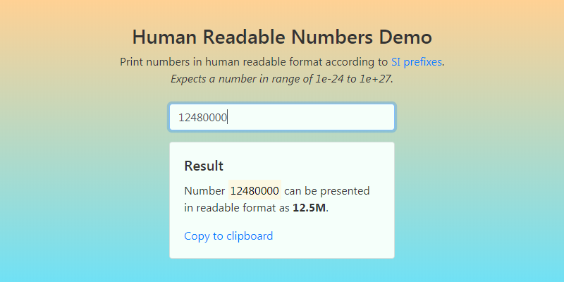

# Human Readable Numbers Demo
Simplest web application example for opening part of web development workshop.

Contains of two variations of application that carry out the same task, but the first is [client-only](#client-only) and the second is [client-server](#client-server). The task is calculate and print out human readable representation of a number using a foreign library.

## Before start
Make sure you have [node.js](https://nodejs.org/en/download/) v6 or latest.

After cloning the repository install dependencies using npm:
```bash
npm i
```

## Client-only


Just open [index.html](client-only/index.html) in a browser.

## Client-server
*coming soon*