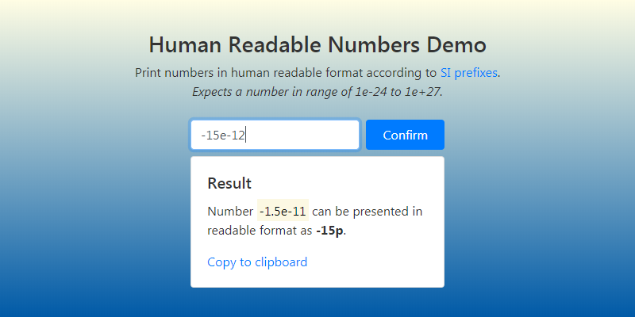

# Human Readable Numbers Demo
Simplest web application example for opening part of web development workshop.

Contains of two variations of application that carry out the same task, but the first is [client-only](#client-only) and the second is [client-server](#client-server). The task is calculate and print out human readable representation of a number using a foreign library.

## Before start
Make sure you have [node.js](https://nodejs.org/en/download/) v6 or latest.

After cloning the repository install dependencies using npm:
```bash
npm i
```

## Client-only
Just open [client-only/index.html](client-only/index.html) in a browser.


## Client-server
Start the [server](client-server/server.js) using node:
```bash
node client-server/server.js
```
You will see the initial output:
```bash
Server started on port 3000
```
And then go to *localhost:3000* in the URL bar in a browser.

